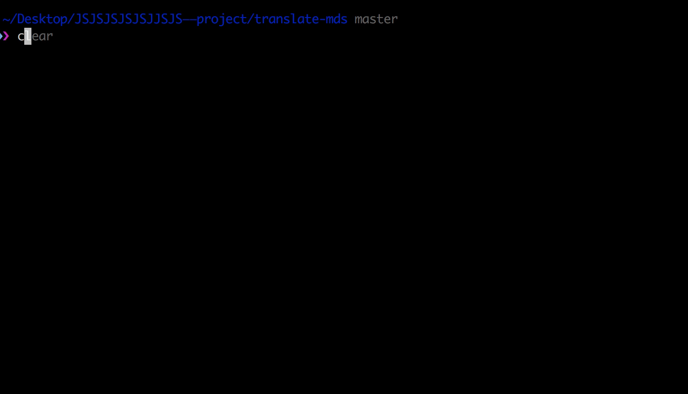
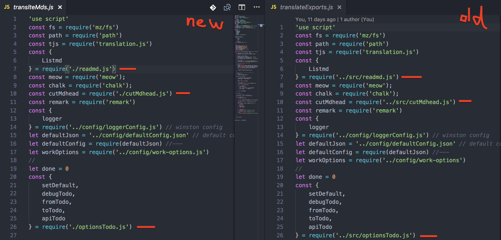
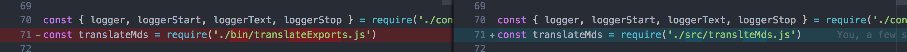

# path-run[](https://travis-ci.org/chinanf-boy/Path-run) [](https://codecov.io/gh/chinanf-boy/Path-run?branch=master)

> Esay change you require paths now

[Chinese](./readme.md)\|[English](./readme.en.md)

If you change the location of a file, then the corresponding file modification of other files is a problem.

You can try`path-run`, change your file location is not so manual

## Install

	npm install --global path-run


## Correct use of -cli

1.  Copy files to destination


    - demo
    	- index.js
    	- input
    		- input1.js
    		- input2.js
    	- output
    		- output1.js
    		- output2.js

    - demo
    	- index.js
    	- input
    		- ✂️input1.js // <===== copy to output
    		- input2.js
    	- output
    		- ➕output3.js // <===== from input/input1.js
    		- output1.js
    		- output2.js

2.  Running`Cli`

```bash
path-run demo/input/input1.js demo/output/output3.js
# path-run [input] [output]
```

1⃣️`Process.cwd()`All references below`Input`The path will become`Output`
2⃣️ `Output` file , inside `require/import` file path change right relative path

3.  Remove`Input1.js`


    - demo
    	- index.js
    	- input
    					<===== ✂️cut
    		- input2.js
    	- output
    		- output3.js // <===== from input/input1.js
    		- output1.js
    		- output2.js

[real-project transltemds](https://github.com/chinanf-boy/translate-mds/commit/af88620139276479a86185c731f4862ec54a54e4)

cli demo



inpath with outpath diff



other require file diff



* * *

## Warnning⚠️ , `path-run` do not change `package.json` main or bin string, pleace rechange yourself


---

## Api

### Pathrun({options})

#### Options

##### 1. InPath

Type:`String`

Abs path

##### 2. OutPath

Type:`String`

Abs path

##### 3. cwd

Type:`String`

Default :`Process.cwd()`

##### return

Type: `Array`

`Array[i]` like this

``` js
const options = {
  files: 'path/to/file',
  from: /foo/g,
  to: 'bar',
};
```

by `replace-in-file` use

https://github.com/adamreisnz/replace-in-file

## Cli

    npm install --global path-run

      esay change you require paths Now

      Usage
        $ path-run [input] [output]

      Options
            input  「want to change」
            output  [turn on ]

      Examples
            $ path-run './index' './lib/index'

      will change all process.cwd()/* files require Path 'index' => './lib/index'

## concat

[nodepaths](https://github.com/chinanf-boy/NodePath) js module map

## License

Mit ©[Chinanf-boy](http://llever.com)
